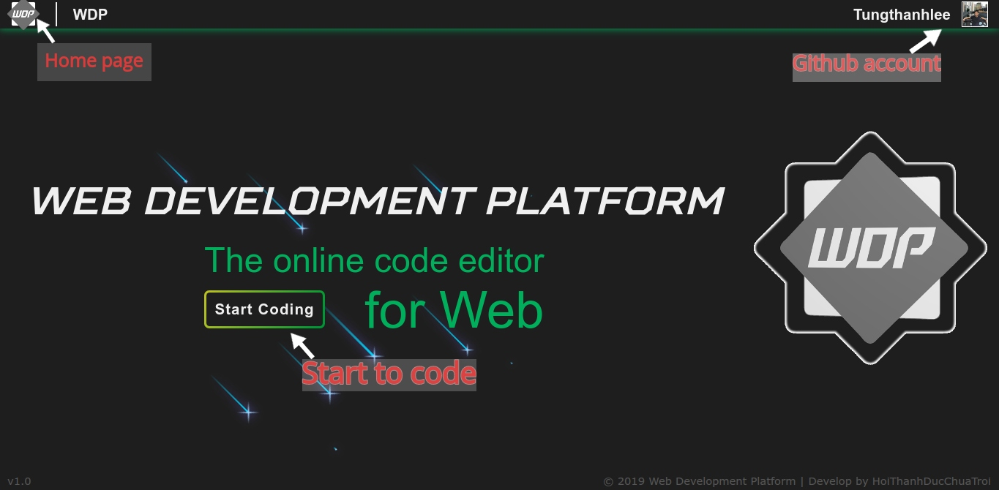
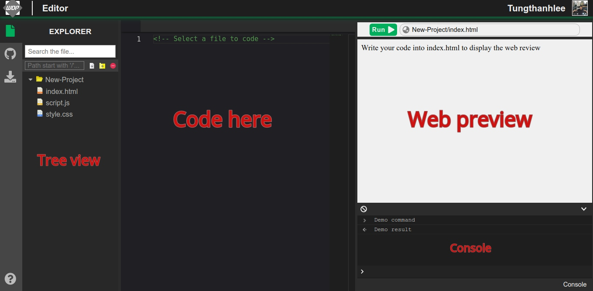
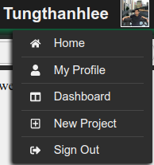
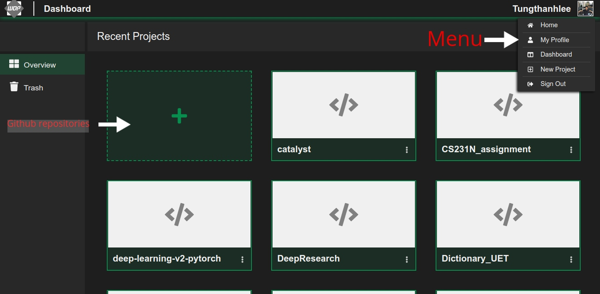

# Documentation
 
 ````
 If you are using Chrome Browser, please go to :
       chrome://settings/content/cookies
 then uncheck block third-party cookies
 ````

## Content
1. Overview
2. Main feature
    * Home page
    * Main editor
    * Menu
    * Github
3. How to use

### 1. Overview
Wep development platform(WDP) is an editor that's build for web development. Web application development is a growing field, and with all new configuration options it becomes harder and harder to focus on writing code. We make this easier by doing most configuration for you.<br/>
This focus on web application development allows us to do many more optimizations. We can analyze npm dependencies, we can show custom error messages for known errors, we can make projects easily searchable by npm dependency. The possibilities are endless!

### 2. Main features
### Home page

This is our home page when you first see our project. <br/>
On the left corner, this is a shortcut `WDP` to quickly return home page. <br/> 
On the right corner, this is your github account (here is my github account) if you already `sign in with github`. <br/>
In the middle, there is a button to `Start Coding`. Click there to start your journey

### Main editor

On the left side, there is a `Tree View`. You can `Search your file`, `Add file`, `Add folder` and `Delete`. There already exists 3 default files `index.html`, `script.js`, `style.css` in your project. <br/>
In the middle is where you code. <br/>
On the right side, there have `web preview` and your `console log`. <br/>

### Menu

### Github repository

When you loged in with github, this will automatically list all your github's repositories. You can create new repo by click to big plus. Also, you can quickly access to this dashboard by click to menu on the right cornor.


# WDP-project
<br/>
    - React-monaco-reference : https://github.com/SurenAt93/monaco-react<br/>
    - React-Monaco-sample : https://github.com/Microsoft/monaco-editor-samples/<br/>
    - Tree view : https://github.com/fiffty/react-treeview-mui


